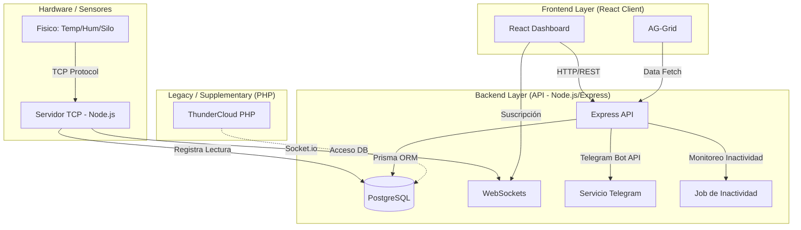

# ThunderSC - Arquitectura del Sistema de Monitoreo

ThunderSC es una plataforma híbrida de monitoreo de sensores diseñada para la captura de datos en tiempo real, visualización histórica y generación de reportes operativos. El sistema integra componentes modernos en Node.js y React con una infraestructura base de datos compartida.

## 🏗️ Visión General de la Arquitectura

## 🧩 Componentes Principales

### 1. Backend API (`/api`)
El corazón del sistema moderno, encargado de la orquestación de datos y comunicación.
- **Servidor TCP**: Escucha conexiones directas de hardware. Parsea tramas de datos y las almacena en la tabla `ma_regzoro`.
- **Express Server**: Expone endpoints REST para el frontend.
- **Prisma ORM**: Gestiona la interacción con la base de datos PostgreSQL.
- **Servicio de Inactividad**: Un proceso en segundo plano que verifica silos y termómetros cada 10 minutos. Si un sensor no reporta en >60 min, dispara una alerta de Telegram.
- **Telegram Bot**: Sistema de notificaciones críticas para alertas de temperatura y fuera de línea.

### 2. Frontend Client (`/client`)
Interfaz de usuario premium construida con **React** y **Vite**.
- **Dashboard**: Visualización en tiempo real con micro-animaciones (termómetros dinámicos).
- **Gráficas Históricas**: Implementadas con **Recharts**, sincronizadas en tiempo real y con soporte de downsampling (promedio por hora) para rangos largos.
- **Reportes (Data Grid)**: Uso de **AG-Grid (Quartz Theme)** con filtros masivos y exportación nativa a Excel (`.xlsx`).
- **Diseño**: Estética de Thunder (Oscura/Premium) usando **Tailwind CSS**.

### 3. Base de Datos
- **PostgreSQL**: Motor principal.
- **Tablas Clave**:
    - `ma_equipo`: Catálogo de sensores y límites (adc_1, adc_3).
    - `ma_regzoro`: Historial masivo de lecturas.
    - `ma_sesus`: Permisos de visualización de sensores por usuario.

## 🔄 Flujo de Datos

1.  **Captura**: El sensor envía una trama TCP al puerto configurado.
2.  **Procesamiento**: El `tcpServer.js` parsea el nombre del sensor y sus valores.
3.  **Alerta**: Se verifican umbrales. Si hay anomalía, se notifica via `telegramService.js`.
4.  **Persistencia**: La lectura se guarda con corrección de zona horaria local.
5.  **Visualización**: El frontend refresca los datos mediante polling u observación de la tabla de reportes.

## 🚀 Tecnologías
- **Frontend**: React 19, Recharts, AG-Grid, Tailwind, Lucide React.
- **Backend**: Node.js, Express, Prisma, WebSocket (Socket.io), Day.js.
- **Hardware**: Comunicación TCP Socket.